<p align="center">
  
</p>

<p align="center">
  <a href="https://github.com/PrimeBuild-pc/SockTuner/commits/main"></a>
  <a href="https://github.com/PrimeBuild-pc/SockTuner/stargazers"></a>
  <a href="https://github.com/PrimeBuild-pc/SockTuner/issues"></a>
</p>

<p align="center">
  <a href="https://github.com/PrimeBuild-pc/SockTuner/actions/workflows/ci.yml"></a>
  <a href="https://github.com/PrimeBuild-pc/SockTuner/releases"></a>
  <a href="https://github.com/PrimeBuild-pc/SockTuner/releases"></a>
  <a href="LICENSE"></a>
  
  
</p>

> [!WARNING]
> **SockTuner is in active development (pre-alpha) and is NOT ready for production use.**
> The project is currently at **Step 7 of 10: hardware capability collection**. The published build is a read-only inventory, diagnostics, and data-collection tool. NIC/driver tuning is still locked and no release can modify your network configuration. Do not rely on it as a finished product.

SockTuner is intended for tweakers, technicians, competitive gamers, system integrators, and power users who need one place to inspect and control the Windows networking stack, network adapters, and NIC driver settings.

It is not a generic “make my ping lower” button. SockTuner will show the current value, proposed value, scope, expected trade-off, restart requirement, and rollback data for every change.

## Help wanted: hardware capability probe

SockTuner exposes only settings that the NIC driver actually advertises. Virtual machines do not expose real driver properties, so we are collecting capability reports from real hardware — especially **Intel I219/I225/I226** and **Realtek RTL8111/RTL8125** adapters.

If you have one of these NICs, you can contribute in two minutes with the built-in read-only probe. **The probe changes nothing on your PC** — it only reads the same inventory the app already displays.

### How to run the probe

1. Download the latest `SockTuner-*-win-x64.zip` from [Releases](https://github.com/PrimeBuild-pc/SockTuner/releases) and extract it.
2. The build is currently **unsigned**, so Windows SmartScreen will warn you: click **More info → Run anyway**. You can inspect the source and build it yourself with `dotnet publish` if you prefer.
3. Open a terminal in the extracted folder (File Explorer address bar → type `cmd` → Enter) and run:
   ```
   SockTuner.exe --probe
   ```
4. A dialog confirms the report location: `socktuner-probe-<timestamp>.json` on your **Desktop**.

### What the probe collects

| Included (hardware identity) | Masked (personal data) |
| --- | --- |
| NIC description, driver provider/version/date, INF name | Machine name |
| PCI vendor/device ID (`PCI\VEN_xxxx&DEV_xxxx`) | IP addresses, gateways, DNS servers, routes |
| NDIS advanced properties: keyword, current value, default, type, valid ranges/enums | MAC address (only the vendor OUI prefix is kept) |
| OS version, admin state, CPU count | User-assigned values (e.g. a custom `NetworkAddress` MAC) |

The report is a plain-text JSON file — open it in any editor and check it yourself before sending.

### How to send your report

- **GitHub:** open an [issue](https://github.com/PrimeBuild-pc/SockTuner/issues/new) titled `Probe report: <your NIC model>` and attach the JSON file.
- **Discord:** open a ticket on our Discord server (invite link in the repository sidebar) and attach the JSON file.

Include your Windows version if you know it. Thank you!

## Product goals

- Inspect the system before recommending or changing anything.
- Cover Windows TCP/IP, Winsock, IP interfaces, NIC offloads, RSS, interrupts, power management, MTU, DNS, QoS, and driver-advertised advanced properties.
- Prefer documented Windows APIs and driver capabilities over scripts, hard-coded adapter names, or localized property labels.
- Preview every change as a diff and verify it after application.
- Snapshot exact original values and provide reliable per-session rollback.
- Measure latency, jitter, packet loss, path MTU, DNS response, route quality, and before/after results.
- Diagnose gaming connectivity layer by layer: PC/NIC, LAN or Wi-Fi, router/modem, access link, ISP, routing/peering, server region, and remote endpoint.
- Run without third-party command-line tools for normal operation.
- Remain useful to experts: no hidden presets and no unexplained “recommended” values.

## Planned feature areas

| Area | Scope |
| --- | --- |
| System inventory | OS build, CPU topology, active routes, interfaces, driver identity/version, link state, addresses, DNS, bindings, and supported NIC properties |
| NIC tuning | Interrupt moderation, RSS, RSC, LSO, checksum offloads, USO/URO, queue and buffer settings, flow control, jumbo frames, EEE, wake, and power-saving controls |
| Windows networking | TCP templates and global settings, per-interface settings, MTU, metrics, DNS, QoS policies, TCP ACK/Nagle controls, and Winsock catalog inspection |
| Gaming diagnostics | Layered PC-to-game-server testing, latency/loss/jitter percentiles, route and region analysis, DNS and connection timing, path MTU, loaded latency, likely-cause ranking, and targeted fixes |
| Change management | Dry run, compatibility gates, risk labels, snapshots, read-back verification, audit history, export, and exact rollback |
| Profiles | Transparent, editable profiles built only from independently supported and tested settings |

See the [Documentation Index](docs/README.md) and [Product Scope](docs/PRODUCT_SCOPE.md) for the proposed feature boundary.

## Proposed technology

- **Language:** C#
- **Runtime:** .NET 10 LTS
- **Desktop UI:** WPF
- **Initial target:** Windows 10 22H2 and supported Windows 11 releases, x64
- **Distribution:** signed, self-contained Windows build

WPF is the deliberate choice for a Windows-only administrative tool: it is mature, works across Windows 10 and 11, integrates cleanly with native Windows management surfaces, and avoids a browser runtime or an unnecessary UI platform dependency.

Read the full [Architecture](docs/ARCHITECTURE.md), [Implementation Roadmap](docs/ROADMAP.md), and [Development Guide](docs/DEVELOPMENT.md).

## Engineering position

Network settings are workload-, driver-, OS-, and topology-dependent. Disabling RSS, ECN, auto-tuning, offloads, or interrupt moderation is not universally beneficial. Nagle-related changes affect TCP, while many games primarily use UDP. Client-side throttling is not a universal replacement for router-side SQM/AQM and cannot eliminate every form of bufferbloat.

The reference scripts in this private workspace are research inputs, not production code or verified recommendations. Their conflicting values and undocumented registry edits must be validated against official documentation, driver-advertised capabilities, repeatable benchmarks, and rollback tests before they can become SockTuner features.

## Current stage

- Architecture and product scope approved.
- Step 1 is complete: the dark Metro shell, application icon, OS/adapter inventory, driver-advertised NDIS discovery, filtering/copy, and DPI validation pass.
- Native IPv4/IPv6 routes and metrics, interface indexes/MTU/DNS, network profiles and bindings, NIC counters, TCP templates, QoS policies, global/RSS/RSC/LSO/checksum/USO/URO offload state, Winsock catalog, bounded structured logs, full/redacted snapshot export, retention preferences, and log export provide the Step 2 inventory.
- Steps 1–2 now pass inventory, export, search/copy, dark-theme, and 100–200% WPF DPI validation.
- Step 3 adds explicit quick/standard/extended diagnostics, concurrent boundary probes, full statistics/timelines, route/MTU/counter evidence, and bounded continuous monitoring.
- Step 4 includes versioned JSON, self-contained offline HTML, bounded local history, redacted history export, identical-parameter before/after comparison, and multi-run trends.
- Step 5 is complete with an allowlisted dry-run cart, exact rollback preview, bounded audit history, deterministic transactions, failure injection, and a strict typed elevated-worker protocol.
- Step 6 is complete: the first two low-disruption MMCSS settings passed direct and published-worker apply/read/rollback/read gates on disposable Windows 10 22H2 and Windows 11 VMs. NIC/driver writes and the normal UI remain locked while Step 7 starts.
- Step 7a adds a read-only `--probe` mode: it writes a redacted capability report (`socktuner-probe-<timestamp>.json` on the Desktop) that collaborators with real Intel/Realtek NICs can share. Personal data is masked; driver identity, NDIS keywords, defaults, and valid ranges/enums are preserved. The probe changes nothing on the machine.

## Important notice

Changing network, registry, adapter, or driver settings can interrupt connectivity or reduce stability and throughput. Pre-release builds must be tested on disposable systems or with a known recovery path. The current release cannot apply any change: tuning writes are locked until they pass real-hardware validation gates.

SockTuner is released under the [MIT License](LICENSE). The public contribution policy is still being defined; probe reports via issues or Discord are the best way to help right now.
