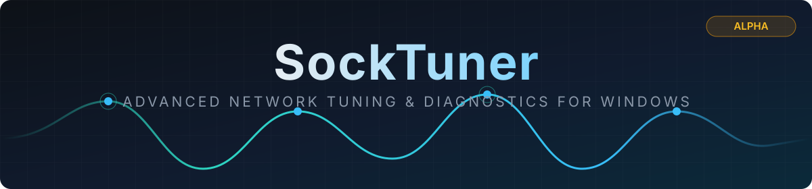

  

  
  
  

  
  
  
  
  
  

> [!WARNING]
> **SockTuner is a community diagnostic alpha, not production software.** Read-only inventory and diagnostics are the primary public surface. Tuning is experimental and can change live network settings. Applying a NIC property restarts that adapter and briefly drops its link — never do this through the connection being changed. Every write requires consent and elevation, is snapshotted, verified by read-back, audited, and reversible.

SockTuner is intended for tweakers, technicians, competitive gamers, system integrators, and power users who need one place to inspect and control the Windows networking stack, network adapters, and NIC driver settings.

It is not a generic “make my ping lower” button. SockTuner will show the current value, proposed value, scope, expected trade-off, restart requirement, and rollback data for every change.

## Help improve hardware compatibility

SockTuner exposes only settings that the installed NIC driver actually advertises. We need reports from real hardware — especially **Intel I219/I225/I226**, **Realtek RTL8111/RTL8125**, Killer/Qualcomm, Broadcom, and Marvell adapters.

1. Download and extract the latest Windows x64 build from [Releases](https://github.com/PrimeBuild-pc/SockTuner/releases).
2. Refresh the inventory, then open **Preferences → Help improve SockTuner**.
3. Choose **Create compatibility report**, review the plain-text JSON, and let SockTuner open the dedicated GitHub issue form.
4. Attach the JSON file to the issue.

The report contains the adapter model, driver version, OS version, and driver-advertised keywords and constraints. It excludes all current setting values, persistent adapter/PNP identifiers, MAC and IP addresses, routes, DNS servers, INF and user paths, machine name, and exact timestamps. Creating it is read-only and changes nothing on the PC.

## Product goals

- Inspect the system before recommending or changing anything.
- Cover Windows TCP/IP, Winsock, IP interfaces, NIC offloads, RSS, interrupts, power management, MTU, DNS, QoS, and driver-advertised advanced properties.
- Prefer documented Windows APIs and driver capabilities over scripts, hard-coded adapter names, or localized property labels.
- Preview every change as a diff and verify it after application.
- Snapshot exact original values and provide reliable per-session rollback.
- Measure latency, jitter, packet loss, path MTU, DNS response, route quality, and before/after results.
- Diagnose gaming connectivity layer by layer: PC/NIC, LAN or Wi-Fi, router/modem, access link, ISP, routing/peering, server region, and remote endpoint.
- Run without third-party command-line tools for normal operation.
- Remain useful to experts: no hidden presets and no unexplained “recommended” values.

## Planned feature areas

| Area | Scope |
| --- | --- |
| System inventory | OS build, CPU topology, active routes, interfaces, driver identity/version, link state, addresses, DNS, bindings, and supported NIC properties |
| NIC tuning | Interrupt moderation, RSS, RSC, LSO, checksum offloads, USO/URO, queue and buffer settings, flow control, jumbo frames, EEE, wake, and power-saving controls |
| Windows networking | TCP templates and global settings, per-interface settings, MTU, metrics, DNS, QoS policies, TCP ACK/Nagle controls, and Winsock catalog inspection |
| Gaming diagnostics | Layered PC-to-game-server testing, latency/loss/jitter percentiles, route and region analysis, DNS and connection timing, path MTU, loaded latency, likely-cause ranking, and targeted fixes |
| Change management | Dry run, compatibility gates, risk labels, snapshots, read-back verification, audit history, export, and exact rollback |
| Profiles | Transparent, editable profiles built only from independently supported and tested settings |

See the [Documentation Index](docs/README.md) and [Product Scope](docs/PRODUCT_SCOPE.md) for the proposed feature boundary.

## Proposed technology

- **Language:** C#
- **Runtime:** .NET 10 LTS
- **Desktop UI:** WPF
- **Initial target:** Windows 10 22H2 and supported Windows 11 releases, x64
- **Distribution:** signed, self-contained Windows build

WPF is the deliberate choice for a Windows-only administrative tool: it is mature, works across Windows 10 and 11, integrates cleanly with native Windows management surfaces, and avoids a browser runtime or an unnecessary UI platform dependency.

Read the full [Architecture](docs/ARCHITECTURE.md), [Implementation Roadmap](docs/ROADMAP.md), and [Development Guide](docs/DEVELOPMENT.md).

## Engineering position

Network settings are workload-, driver-, OS-, and topology-dependent. Disabling RSS, ECN, auto-tuning, offloads, or interrupt moderation is not universally beneficial. Nagle-related changes affect TCP, while many games primarily use UDP. Client-side throttling is not a universal replacement for router-side SQM/AQM and cannot eliminate every form of bufferbloat.

The reference scripts in this private workspace are research inputs, not production code or verified recommendations. Their conflicting values and undocumented registry edits must be validated against official documentation, driver-advertised capabilities, repeatable benchmarks, and rollback tests before they can become SockTuner features.

## Current stage

- Native read-only inventory covers adapters, routes, interfaces, DNS, profiles, bindings, NIC counters, TCP templates, QoS, offloads, interrupts, Winsock, driver identity, and driver-advertised properties.
- The complete network check measures each path boundary, latency/loss/jitter, DNS and TCP timing, path MTU, route quality, counter deltas, and game-specific playability; loaded-latency and throughput traffic remain separate opt-in tests.
- Versioned reports, bounded local history, redacted exports, before/after comparison, trends, monitoring, and imported capture reports are available.
- Experimental writes use one allowlisted tuning plan with dry run, consent, elevation, stale-state refusal, read-back verification, audit, visible recovery, and exact rollback.
- Real-hardware coverage is crowdsourced through the in-app compatibility report. The generated [capability archive index](alpha-tester-output/INDEX.md) lists current Intel, Realtek, and MediaTek coverage.

## How a change is applied

1. Pick an adapter and a focus preset; only driver-advertised properties are listed, each with its current value, the driver default, the accepted values, a risk level and the trade-off it costs.
2. **Preview** builds a dry run through a read-only store: current versus proposed, what rollback would restore, and the restart requirement.
3. **Apply** asks for the one-time alpha consent, then elevates. High-risk or experimental changes need `APPLY` typed to confirm.
4. The elevated worker re-reads the driver, refuses anything it no longer advertises or that drifted since the preview, writes, reads the value back to verify, records an audit entry, then restarts the adapter and confirms it returns to its previous link state.
5. Any audit entry can be rolled back to exactly the values it captured.

## Important notice

Changing network, registry, adapter, or driver settings can interrupt connectivity or reduce stability and throughput. Applying a NIC property restarts that adapter, which briefly drops the link — do not apply over a remote session on the adapter being changed. Test on a machine you can recover without remote access. SockTuner never invents a value or a range: it exposes only what the installed driver advertises, and treats any keyword it has not characterised as high risk.

SockTuner is released under the [MIT License](LICENSE). Compatibility reports and bug reports are welcome through the dedicated GitHub issue forms.
